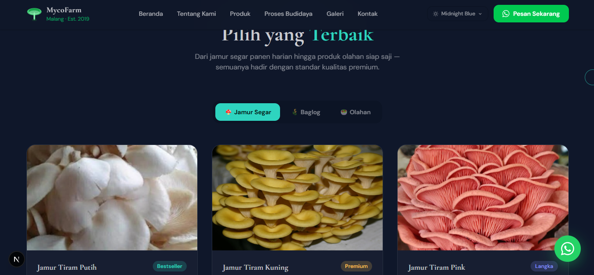
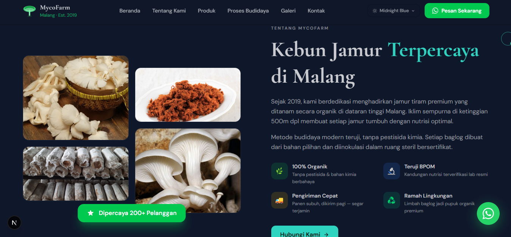

# 🍄 MycoFarm

Profile website and online store for a premium oyster mushroom farm based in Malang, Indonesia.
Built with **Next.js 15**, **Tailwind CSS**, and **DaisyUI**.

---

## 📸 Screenshots

### Navbar & Hero
Clean navigation bar with an interactive Three.js animated background, headline, and WhatsApp CTA button.


### Products
Full product catalog covering fresh oyster mushrooms (white, yellow, pink), baglogs, starter kits, and processed goods like mushroom chips and floss.


### About MycoFarm
Farm profile section with a staggered image collage, key highlights, and a brief story about the brand since 2019.


### Gallery
Dynamic masonry photo grid with lightbox support. Admin can upload new photos directly from the UI.


### Contact
Contact form and floating WhatsApp button for quick order inquiries.


---

## 🚀 Features

- **Hero** - Interactive Three.js background with animated particles and floating shapes
- **Products** - Catalog of fresh mushrooms, baglogs, starter kits, and processed goods
- **Gallery** - Dynamic photo grid with lightbox and admin photo upload
- **About** - Farm profile with staggered image collage
- **Cultivation Process** - Step-by-step oyster mushroom growing guide
- **Contact** - Contact form with WhatsApp integration
- **Dark mode** - Follows system preference automatically
- **Fully responsive** - Mobile-first design

---

## 🛠️ Tech Stack

| Layer | Technology |
|---|---|
| Framework | Next.js 15 (App Router) |
| Styling | Tailwind CSS + DaisyUI |
| Animation | Three.js (hero background) |
| Font | Cormorant Garamond (serif display) |
| Deploy | Vercel |

---

## ⚙️ Installation

```bash
# 1. Navigate to the project folder
cd mycofarm

# 2. Install dependencies
npm install

# 3. Create environment file (optional)
cp .env.example .env.local
# Set GALLERY_PASSWORD in .env.local

# 4. Start the development server
npm run dev
```

Open [http://localhost:3000](http://localhost:3000) in your browser.

---

## 🔐 Environment Variables

Create a `.env.local` file in the project root:

```env
# Password for gallery photo uploads
# Falls back to "mycofarm2024" if not set
GALLERY_PASSWORD=yourpassword
```

---

## 📁 Project Structure

```
mycofarm/
├── app/
│   ├── api/gallery/        # Gallery upload and fetch API
│   ├── produk/             # Product detail pages
│   │   ├── jamur-tiram-putih/
│   │   ├── jamur-tiram-kuning/
│   │   ├── jamur-tiram-pink/
│   │   ├── baglog-siap-panen/
│   │   ├── starter-kit/
│   │   └── olahan/
│   ├── galeri/             # Full gallery page
│   ├── tentang/            # About page
│   ├── kontak/             # Contact page
│   └── proses-budidaya/    # Cultivation process page
├── components/
│   ├── Hero.tsx            # Hero section with Three.js
│   ├── Products.tsx        # Product catalog
│   ├── Gallery.tsx         # Photo gallery with upload
│   ├── About.tsx           # About section
│   ├── Budidaya.tsx        # Cultivation process
│   ├── Nutrition.tsx       # Mushroom nutrition info
│   ├── HealthBenefits.tsx  # Health benefits section
│   ├── Testimonials.tsx    # Customer testimonials
│   ├── Stats.tsx           # Business statistics
│   ├── Contact.tsx         # Contact form
│   ├── Navbar.tsx          # Navigation bar
│   ├── Footer.tsx          # Footer
│   ├── WAFloat.tsx         # Floating WhatsApp button
│   └── Cursor.tsx          # Custom cursor
└── public/
    └── images/             # Local product and content images
```

---

## 📷 Gallery Admin

The photo upload feature is available on the Gallery section. Click the **"Upload Foto"** button and enter the admin password.

- Supported formats: JPG, PNG, WebP
- Maximum file size: 5MB per photo
- Uploaded files are saved to `public/uploads/gallery/`
- Metadata is stored in `public/gallery-data.json`

---

## 📞 Contact

The WhatsApp number can be changed via the `WA_NUM` constant in each component:

```ts
const WA_NUM = "6281234567890"; // replace with active number
```

---

## 📄 License

© 2026 MycoFarm. All rights reserved.

---

Built by rayn [->](https://rayn.web.id)
